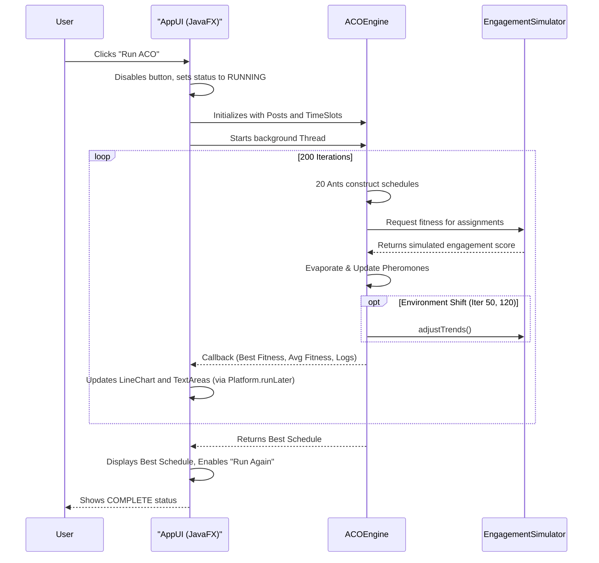

# 🐜 Social Media Optimizer - Project Analysis

## 📌 Overview
The **Social Media Optimizer** is a JavaFX-based desktop application that leverages the **Ant Colony Optimization (ACO)** algorithm to determine the most effective posting schedule for various social media content types. It simulates real-world constraints such as time slots, content types (reels, memes, educational), and dynamic audience engagement trends to compute a "fitness" score for different scheduling permutations.

## 🛠️ Tech Stack
- **Language:** Java 17
- **UI Framework:** JavaFX 21.0.1
- **Build Tool:** Maven
- **Core Algorithm:** Ant Colony Optimization (ACO)

## 🏗️ Architecture & Project Structure
The project is built with a modular architecture separating the user interface, domain models, algorithm logic, and simulation engine.

```text
d:\TY-Study\DAA\CP\Project\
├── pom.xml                   # Maven configuration and dependencies (JavaFX)
├── src/main/resources/
│   └── style.css             # Vanilla CSS for styling the JavaFX UI
└── src/main/java/
    ├── AppUI.java            # Main JavaFX application entry point & UI layout
    ├── ACO/
    │   └── ACOEngine.java    # Core Ant Colony Optimization algorithm implementation
    ├── Models/
    │   ├── ContentType.java  # Enum defining types of posts (REEL, MEME, EDUCATIONAL)
    │   ├── Post.java         # Represents a social media post
    │   ├── TimeSlot.java     # Represents a specific time slot (e.g., Morning, Night)
    │   └── Schedule.java     # Represents a complete mapping of Posts to TimeSlots
    └── Simulation/
        └── EngagementSimulator.java # Calculates engagement (fitness) based on trends
```

### Component Details
1. **`AppUI.java` (Frontend)**
   - Acts as the main entry point for the application.
   - Implements a modern **TabPane Architecture** to organize data efficiently:
     - **Tab 1 (Live Analytics):** Real-time `LineChart` and execution logs.
     - **Tab 2 (Configuration):** User-adjustable inputs (Ants, Alpha, Beta, Iterations) and cleanly separated panels for Post and Time Slot data.
     - **Tab 3 (Results & Matrix):** Final optimized schedule table and the resulting Pheromone matrix.
   - Uses `style.css` for a premium **Glassmorphism Dark Theme**, featuring custom pill-shaped tabs and glowing neon accents.
   - Handles multithreading to ensure the ACO engine runs in the background without freezing the UI thread, utilizing `Platform.runLater()` for UI updates.

2. **`ACOEngine.java` (Algorithm)**
   - Implements the ACO logic dynamically based on user-provided control panel inputs (`numAnts`, `alpha`, `beta`, `numIterations`).
   - Manages the **Pheromone Matrix** (Posts x TimeSlots).
   - **Exploration & Convergence:** Ants construct solutions probabilistically based on pheromone trails and heuristic desirability.
   - **Environment Shifts:** Simulates algorithm adaptability by triggering trend shifts at specific iterations (e.g., iteration 50 and 120).

3. **`EngagementSimulator.java` (Simulation)**
   - Provides the heuristic data ("fitness score") to evaluate schedules.
   - Factors in base scores for content types, time weight matrices, and random noise to simulate unpredictable real-world social media algorithms.

4. **Models (`Models/`)**
   - Encapsulates the domain logic. `Schedule.java` also calculates its own overall fitness by aggregating the engagement score of individual Post-TimeSlot assignments and applying penalties for overloading the same time slot.

## 🔄 Program Flow



## 🚀 Execution Steps

Since this project utilizes Maven and the `javafx-maven-plugin`, executing the application is straightforward.

### Prerequisites
1. **Java Development Kit (JDK) 17** or higher installed.
2. **Apache Maven** installed and added to your system's PATH.

### Usage Instructions
1. Open your terminal (or PowerShell).
2. Navigate to the project root directory:
   ```bash
   cd "d:\TY-Study\DAA\CP\Project"
   ```
3. Run the application using the Maven JavaFX plugin:
   ```bash
   mvn clean javafx:run
   ```
4. **Configure Parameters:** Upon launch, navigate to the **"Configuration ⚙️"** tab. Adjust the `Ants`, `Alpha`, `Beta`, and `Iterations` directly from the interface.
5. **Start Simulation:** Click the pulsing **"Run ACO 🔄"** button on the top header.
6. **Monitor:** Switch to the **"Live Analytics 📈"** tab to watch the algorithm converge in real-time.
7. **View Results:** Once the run completes, check the **"Results & Matrix 🏆"** tab for the final recommended social media schedule.

> [!TIP]
> **Performance Optimization:** Because parameters are exposed in the UI, you can easily experiment with different values. Increasing `Ants` helps find better solutions but takes longer, while tweaking `Alpha` and `Beta` shifts the algorithm's reliance between past successful trails and immediate heuristic desirability!
